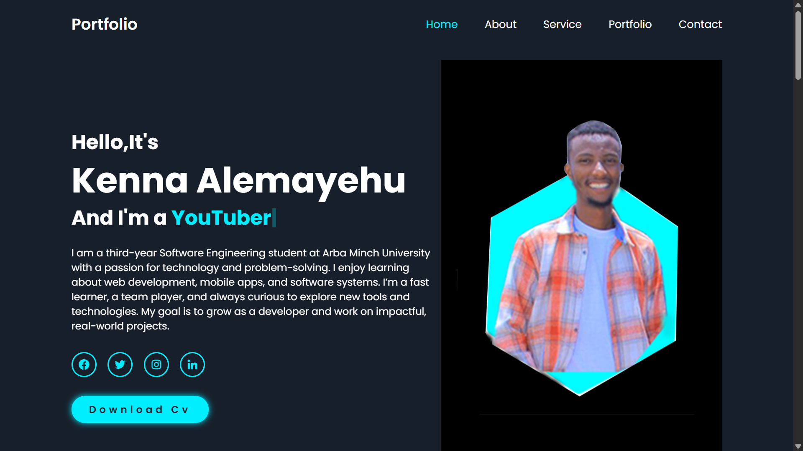
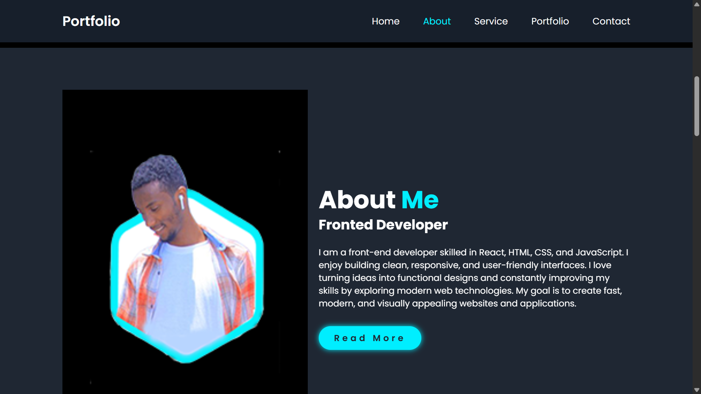
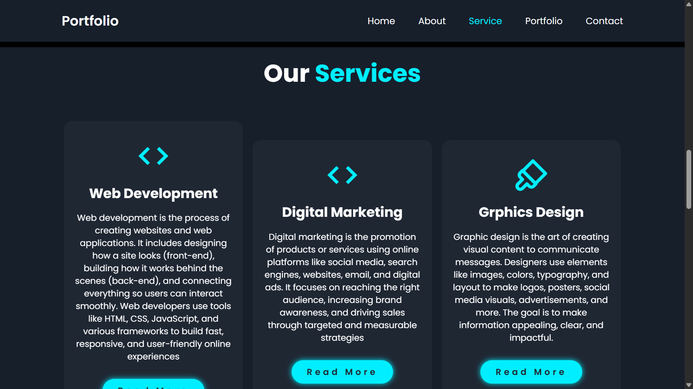
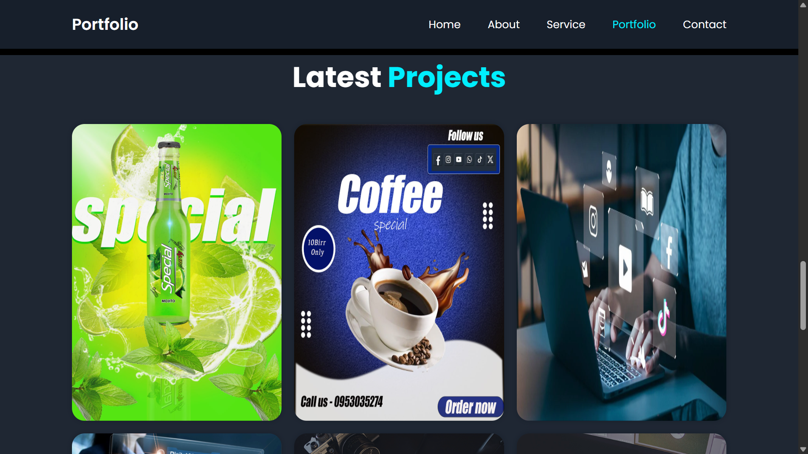
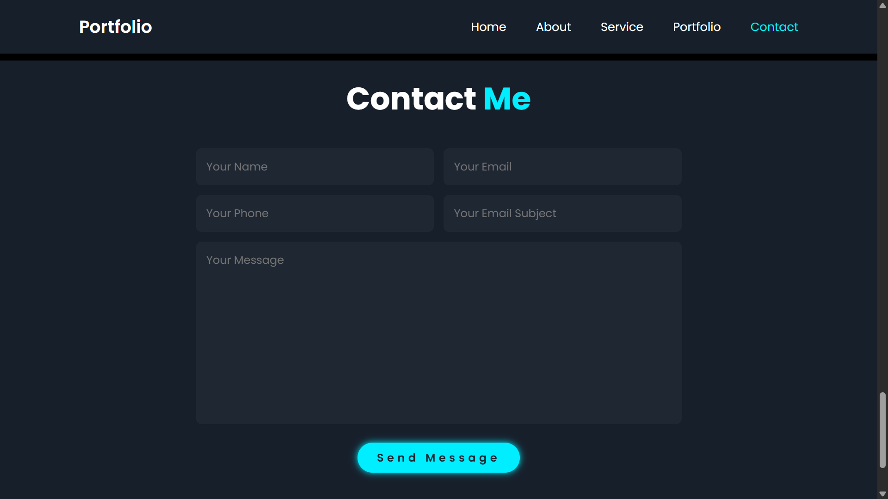

# My Personal Portfolio

A professional personal portfolio website showcasing my skills, projects, education, and experience.

## 📋 About

This portfolio website serves as a comprehensive overview of my professional profile, including:

- **Skills** - Technical and professional competencies
- **Projects** - Showcase of my work and achievements
- **Education** - Academic background and certifications
- **Experience** - Professional work history and accomplishments

## 🖼️ Portfolio Preview

### Home Page


### About Section


### Services


### Portfolio


### Contact


## 🛠️ Tech Stack

- **HTML** (49.1%) - Structure and semantic markup
- **CSS** (39.1%) - Styling and responsive design
- **JavaScript** (8.8%) - Interactivity and dynamic features
- **PHP** (3%) - Backend functionality

## 📁 Project Structure

```
my-first-personal-portfolio/
├── index.html          # Main portfolio page
├── css/                # Stylesheets
├── js/                 # JavaScript files
├── php/                # PHP backend files
├── images/             # Images and media files
└── README.md           # Project documentation
```

## ✨ Features

- Responsive design for mobile, tablet, and desktop
- Modern and clean user interface
- Easy navigation through different sections
- Professional presentation of skills and projects
- Contact information and social media links
- Visually appealing project showcase

## 🚀 Getting Started

### Prerequisites
- A web server (Apache with PHP support recommended for backend functionality)
- A modern web browser

### Installation

1. Clone the repository:
   ```bash
   git clone https://github.com/yohannesalemayehu1012/my-first-personal-portfolio.git
   ```

2. Navigate to the project directory:
   ```bash
   cd my-first-personal-portfolio
   ```

3. Deploy to your web server or open `index.html` in your browser for local viewing

## 💻 Usage

- Open the portfolio in any modern web browser
- Navigate through different sections using the menu
- View projects, skills, and experience
- Use contact information to get in touch

## 🎨 Customization

To customize this portfolio:

1. Edit `index.html` to update content
2. Modify `css/` files to change styling and colors
3. Update `js/` files for interactive features
4. Configure `php/` files for backend functionality
5. Replace images in `images/` folder with your own

## 📞 Contact

For inquiries or collaboration opportunities, please use the contact section on the portfolio website.

## 📄 License

This project is open source and available for personal and educational use.

---

**Last Updated:** September 2026
